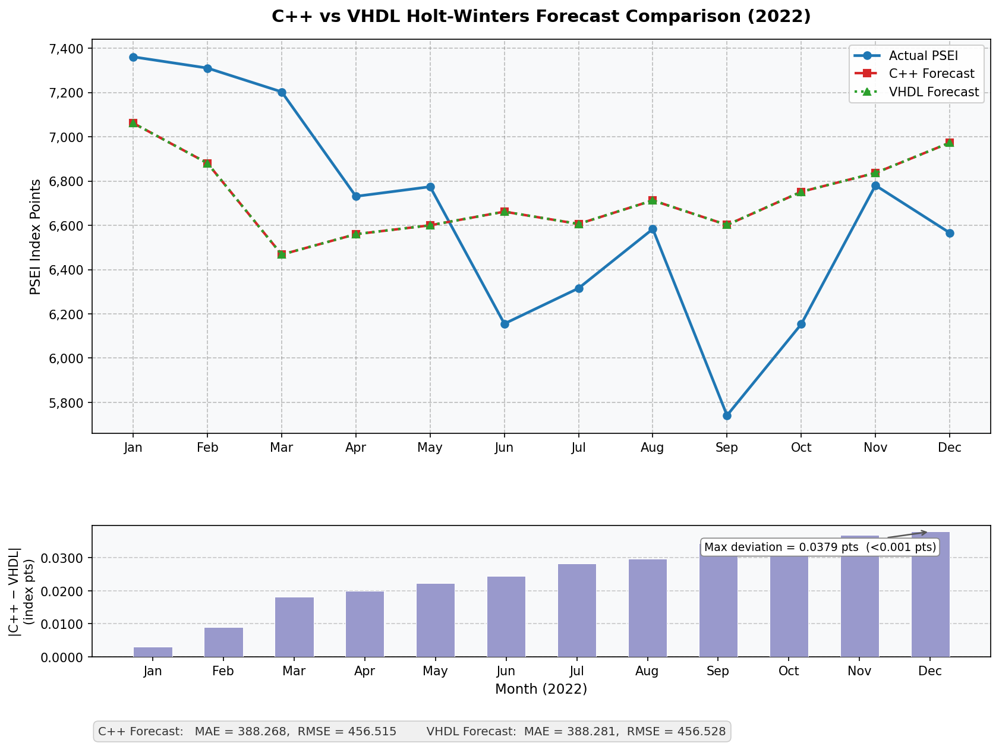

# GA-Optimised Holt-Winters Forecaster — FPGA Hardware Accelerator

A complete hardware-software co-design project implementing a Genetic Algorithm optimised
Holt-Winters time-series forecasting system, accelerated on a Xilinx Zynq-7000 ZedBoard FPGA.
The VHDL hardware accelerator produces numerically equivalent results to the C++ software
baseline with a maximum deviation of 0.037 index points.

---

## Results

| Metric                        | Value                        |
|-------------------------------|------------------------------|
| Clock frequency               | 100 MHz                      |
| Total algorithmic latency     | 651 cycles / 6,510 ns        |
| Forecast throughput           | 50 Msamples/sec              |
| Fitting throughput            | 14.2 Msamples/sec            |
| LUT utilisation               | 4% of ZedBoard               |
| FSM states                    | 18                           |
| Arithmetic format             | Q16.16 fixed-point           |
| Optimisation versions         | 13 iterative VHDL revisions  |
| Simulation result             | TEST COMPLETE ✓ (60 fitted, 12 forecast) |

### Verification — C++ vs VHDL (PSEI 2022)

| Metric | C++ Software | VHDL Hardware | Difference |
|--------|-------------|---------------|------------|
| MAE    | 388.268     | 388.281       | 0.013      |
| RMSE   | 456.515     | 456.528       | 0.013      |
| Max per-sample deviation | — | — | 0.037 pts |



---

## Project Overview

### Problem
Time-series forecasting using Holt-Winters exponential smoothing is computationally
intensive when run repeatedly on embedded or edge systems. Software execution on a
general-purpose CPU introduces latency unsuitable for real-time financial or industrial
monitoring applications.

### Solution
This project builds an end-to-end pipeline:

1. **C++ software baseline** — Holt-Winters additive and multiplicative models with a
   Genetic Algorithm (GA) optimiser that finds the best smoothing parameters
   (α, β, γ ∈ [0,1]) using tournament selection, arithmetic crossover, and Gaussian mutation.

2. **VHDL hardware accelerator** — The forecasting core is implemented as an 18-state FSM
   datapath using Q16.16 fixed-point arithmetic and Xilinx DSP48E1 primitives, achieving
   timing closure at 100 MHz after 13 iterative optimisation versions.

3. **Numerical verification** — VHDL simulation output is compared against the C++ baseline
   on PSEI 2022 data, confirming a maximum deviation of 0.037 index points — negligible
   for financial forecasting applications.

---

## Architecture

```
┌─────────────────────────────────┐
│   GA Parameter Optimiser (C++)  │
│   Population: 40 individuals    │
│   Generations: 80               │
│   Selection: Tournament (k=3)   │
│   Crossover: Arithmetic         │
│   Mutation: Gaussian (σ=0.05)   │
└────────────┬────────────────────┘
             │  optimal α, β, γ
             ▼
┌─────────────────────────────────┐
│  Holt-Winters FPGA Core (VHDL) │
│  ├── 18-state FSM datapath      │
│  ├── Q16.16 fixed-point arith.  │
│  ├── DSP48E1 primitives         │
│  └── ILA debug core             │
└────────────┬────────────────────┘
             │  forecast outputs
             ▼
┌─────────────────────────────────┐
│  Verification (Python/Jupyter)  │
│  VHDL output vs C++ baseline    │
│  MAE deviation: 0.013 pts       │
└─────────────────────────────────┘
```

---

## Repository Structure

```
├── software/
│   ├── HWlogideawithGA.cpp          # GA-optimised Holt-Winters C++ pipeline
│   └── holtwinter_timing_measurement.cpp  # Software timing benchmark
│
├── hardware/
│   ├── hw_version13.vhd             # Final VHDL implementation (100 MHz)
│   ├── hw_top.vhd                   # Top-level wrapper
│   ├── hw_version13_tb.vhd          # Testbench for final version
│   └── archive/                     # All 13 iterative versions
│       ├── hw_version1.vhd          # Initial implementation
│       ├── ...
│       └── hw_version12.vhd         # Pre-final iteration
│
├── verification/
│   ├── hw_ila_idea_check.vhd        # ILA signal capture core
│   └── hw_ila_idea_check_top.vhd   # ILA top-level integration
│
├── results/
│   ├── vhdl_vs_cpp_forecast.png     # C++ vs VHDL comparison plot
│   ├── vhdl_simulation_output.txt   # XSim simulation log (651 cycles verified)
│   ├── VHDLC++.ipynb                # Jupyter notebook — verification analysis
│   ├── combined_forecast_data.csv   # Merged C++ and VHDL forecast data
│   ├── c++output                    # Raw C++ software output
│   └── vhdL-cpp_output              # Raw VHDL simulation output
│
└── docs/
    └── fixed_point_arithmetic.md    # Q16.16 format explained with overflow analysis
```

---

## Dataset

**Philippine Stock Exchange Index (PSEi)**
- Source: [Investing.com PSEI Historical Data](https://www.investing.com/indices/psei-composite-historical-data)
- Training: Monthly closing values 2017–2021 (60 data points)
- Validation: Monthly closing values 2022 (12 data points)
- Live records: [Google Sheets](https://docs.google.com/spreadsheets/d/1Jlnlkz7MGciihZnaL1Oinp2Du0GW2jgkL2XRgizR-6o/edit?usp=sharing)

The dataset can be replaced with any monthly time-series CSV in the format: `Date, Price`.

---

## How to Build and Run

### Requirements
- Xilinx Vivado 2023.x (for VHDL synthesis and simulation)
- Xilinx ZedBoard (Zynq-7000)
- GCC with C++11 support (for software baseline)
- Python 3.x with pandas, numpy, matplotlib (for verification plots)

### Software baseline (C++)

```bash
cd software
g++ -O2 -std=c++11 -o hw_ga HWlogideawithGA.cpp -lm
./hw_ga
# Outputs: forecast_2017_2021_vs_2022_add_vs_mul_log_vs_orig_GA.csv
```

### VHDL simulation (Vivado XSim)

1. Open Vivado → Create project → Add `hardware/hw_version13.vhd` and `hardware/hw_version13_tb.vhd`
2. Run Behavioural Simulation
3. Compare output against `results/vhdl_simulation_output.txt`

### On-hardware deployment (ZedBoard)

1. Add all files in `hardware/` to Vivado project
2. Run Synthesis → Implementation → Generate Bitstream
3. Program ZedBoard via JTAG
4. Use ILA cores in `verification/` for on-hardware signal capture

### Verification plot (Python)

```bash
cd results
jupyter notebook VHDLC++.ipynb
# Run all cells to reproduce vhdl_vs_cpp_forecast.png
```

---

## Development Notes

13 iterative VHDL versions were required to achieve timing closure at 100 MHz.

Key engineering challenges resolved across versions:

| Version | Challenge | Resolution |
|---------|-----------|------------|
| v1–v3   | Initial FSM structure | Established 18-state datapath |
| v7      | Q16.16 overflow in multiplication | Added saturation logic |
| v10     | DSP48E1 pipeline latency misalignment | Corrected register staging |
| v11     | Timing closure at 71 MHz | Restructured critical path |
| v12–v13 | ILA insertion for on-hardware debug | Verified signals in hardware |

The `hardware/archive/` folder preserves the complete development history.

---

## Skills Demonstrated

- **VHDL** — FSM datapath design, fixed-point arithmetic, DSP primitive instantiation
- **FPGA toolchain** — Xilinx Vivado synthesis, implementation, timing closure, ILA debug
- **C++** — Evolutionary algorithm implementation (GA), numerical methods, CSV I/O
- **Hardware-software co-design** — Algorithm to RTL pipeline with numerical verification
- **Python** — Data analysis, matplotlib visualisation, Jupyter notebooks

---

## Project Context

- **Degree**: M.Sc. Electrical Engineering — Electronics Design and Technology
- **University**: Universität Siegen, Germany
- **Supervisor**: M.Sc. Lasya Indukuri, Chair of Embedded Systems
- **Scope**: Independent research project (separate from AIP conference publication)

---

## Author

**Akkhilesh Raghuram**
[github.com/akkhil08](https://github.com/akkhil08) · [linkedin.com/in/akkhilesh-raghuram](https://linkedin.com/in/akkhilesh-raghuram)

Records Maintained: 
https://docs.google.com/spreadsheets/d/1Jlnlkz7MGciihZnaL1Oinp2Du0GW2jgkL2XRgizR-6o/edit?usp=sharing


